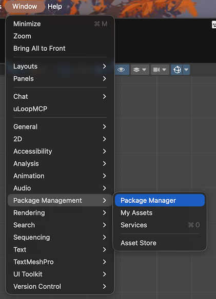
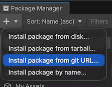
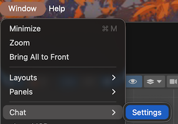
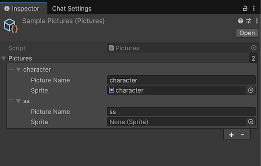
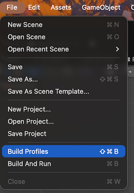
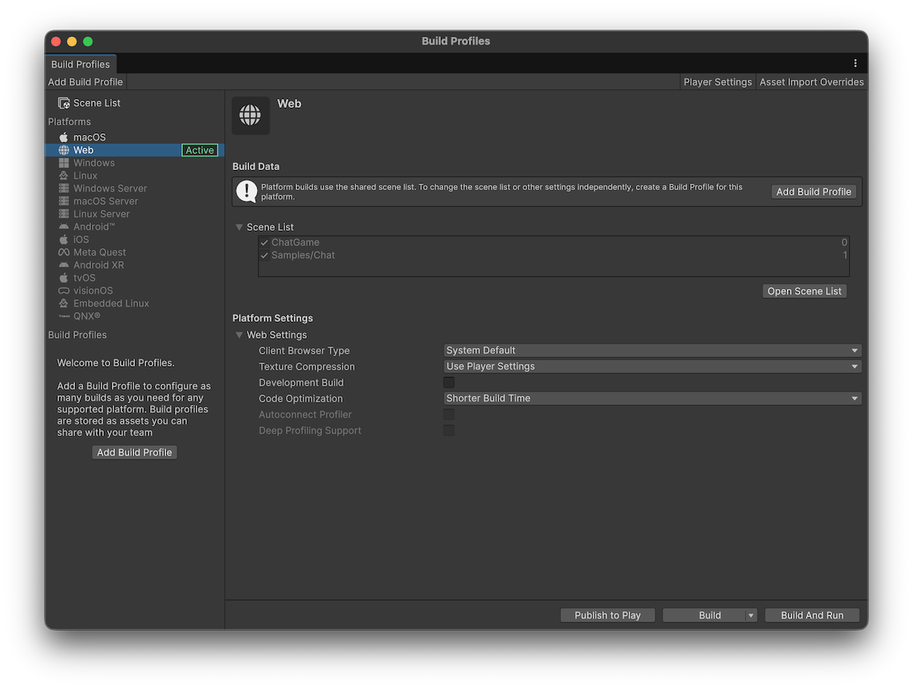

# Template Chat セットアップガイド

このガイドでは、Template Chat をあなたの Unity プロジェクトに導入し、チャットシステムを動かすまでの手順を説明します。

---

## 0. Unityの準備
1. https://unity.com/ja/download からUnity Hubをダウンロードしてインストールします。
2. Unity Hubを起動して、Installs > Install Editor を押してください。バージョンはLTSと書かれたもの(Unity6.0がおすすめ)を選んでください。
3. Add modulesのリストからは 「Web Build Support」にチェックを入れてインストールしてください。

インストールが終わったらUnity Hubの

## 1. パッケージのインストール
1. Unity エディタで **Window** -> **Package Manager** を開きます  


2. 左上の **「+」** ボタンをクリックし、**「Add package from git URL...」** を選択します  


3. 以下の URL を入力して **「Install」** をクリックします：  
`https://github.com/kuluna/Template-Chat.git?path=Assets/Chat`

---

## 2. 設定ウィンドウを開く

1. Unityで **Window** -> **Chat** -> **Settings** を選択します。  


チャットゲームを設定するウィンドウが表示されます。


- あらすじ
- キャラクター画像
- 画像リスト
- シナリオテキスト
- テキスト表示の設定 (TextMeshPro)
- 設定チェック

---

## 3. アセットの用意
用意していただきたいアセットは以下です。

- あらすじ(テキスト)
- キャラクター画像
- シナリオ
- シナリオ中に表示する画像
- 日本語フォント

これらを作成したUnityプロジェクトフォルダの中にあるAssetsフォルダの中にコピーしてください。  
あらすじのみ設定画面から直接入力してください。  
日本語フォントは [Google Fonts](https://fonts.google.com/?lang=ja_Jpan) からお好きなフォントをダウンロードしてください。

## 4. シナリオの作成
チャットに表示する会話文をテキストファイルに書いていくことで会話ができるようになっています。  
基本的な会話から、待機時間や簡易的な条件分岐にも対応しています。

1. 「サンプルシナリオを作成」を押してください。
2. Assets/ChatAssets フォルダに Scenario.txt が作成されます。このファイルにシナリオを記述していきます。

### シナリオの記載例

```text
# これはコメントです（#で始まる行は無視されます）

@text, こんにちは！
@text, チャットシステムのテストです。

@text, 質問です。Unity は好きですか？
@choice, answer, はい, いいえ

@if, answer, はい, LikeUnity
@text, そうですか...残念です。
@goto, End

@label, LikeUnity
@text, 私も大好きです！

@label, End
@text, ご利用ありがとうございました！
```

### コマンド一覧

| コマンド | 書き方 | 説明 |
|---|---|---|
| `@text` | `@text, メッセージ` | テキストを表示します |
| `@image` | `@image, 画像名` | 画像を表示します |
| `@wait` | `@wait, 秒数` | 指定した秒数だけ待機します（最大5秒まで、小数点可） |
| `@choice` | `@choice, 変数名, 選択肢1, 選択肢2, ...` | 選択肢を表示します（最大3つ） |
| `@if` | `@if, 変数名, 期待値, ラベル名` | 条件が一致したらラベルにジャンプ |
| `@goto` | `@goto, ラベル名` | 指定したラベルにジャンプします |
| `@label` | `@label, ラベル名` | ジャンプ先の目印を設定します |

### 制限事項
以下はまだ対応していません。

- 絵文字

## 5. 画像アセットの設定
1. まず画像リストの箱を作るために「画像リストを新規作成」を押してください。
2. Assets/ChatAssetsフォルダに Pictures.asset というファイルが作られるので、それをUnityエディター上で選択してください。
3. インスペクタウィンドウに画像リストを登録する画面が表示されます。「+」ボタンを押してチャットから画像を表示するときの名前と画像を設定してください。  

4. 各項目に以下を設定します：
   - **Picture Name**: シナリオで使用する名前（例: `character`）
   - **Sprite**: 表示したい画像

### シナリオでの画像表示

Pictures アセットに登録した名前を使って画像を表示できます：

```text
@text, キャラクターの画像を表示します
@wait, 1
@image, character1
```

## 6. TextMesh Proの設定
Unityで日本語を表示するためにTextMesh Proというライブラリを使います。  

1. TextMeshPro Essential Resourcesをインポート を押します。
2. インポートが完了したら、フォントファイルに日本語フォントをセットします。
3. TMPフォントアセットを作成 を押します。

## 7. 動作確認

すべての設定が完了したら、「設定内容を確認する」を押します。  
ここで何か設定が漏れていたりしたら再確認してください。

チェックが全てOKならいよいよ「ゲームを作成する」を押してください。
うまく行けばゲームが生成されます！そのままPlayボタンを押して動作確認をしてみてください。

### 画像やシナリオを修正したい
あらすじとキャラクター画像を差し替える場合は再度「ゲームを作成する」を押してください。  
画像リストの変更やシナリオテキストの修正は作成後も反映されます。

## 8. WebGL向けにビルド
いよいよWebGL向けにビルドを行います。

1. File -> Build Profiles を選びます。  

2. 開いたウィンドウからWeb向けであることを確認してBuildボタンを押してください。
   1. 左のPlatformがWebがActiveになっていること。もしなっていなければ、Webを選択して「Switch Platform」を押してください。
   2. 中央のScene Listに「7. 動作確認」で作成したシーン名にチェックが入っていること。もしなっていなければ左上のScene Listからチェックを入れてください。


## うまく動かない場合

### チャットが表示されない
- Chat オブジェクトの **Scenario Text** が設定されているか確認してください
- Console ウィンドウ（**Window** -> **General** -> **Console**）にエラーが表示されていないか確認してください

### 画像が表示されない
- **Pictures** アセットが Chat オブジェクトに設定されているか確認してください
- シナリオの `@image` コマンドで指定した名前が Pictures アセットに登録されているか確認してください

### エラーが発生する
- シナリオファイルの構文が正しいか確認してください
- コマンドは `@` で始まり、引数はカンマ `,` で区切ります
- スペースの有無は問いません（`@text,こんにちは` と `@text, こんにちは` は同じ）

## 次のステップ

- より複雑なシナリオを作成してみましょう
- `@if` コマンドで数値比較（`>10`, `<5`, `=3` など）を試してみましょう
- 独自の UI スタイルにカスタマイズしてみましょう

ご質問やバグ報告は [GitHub Issues](https://github.com/kuluna/Template-Chat/issues) までお願いします。
